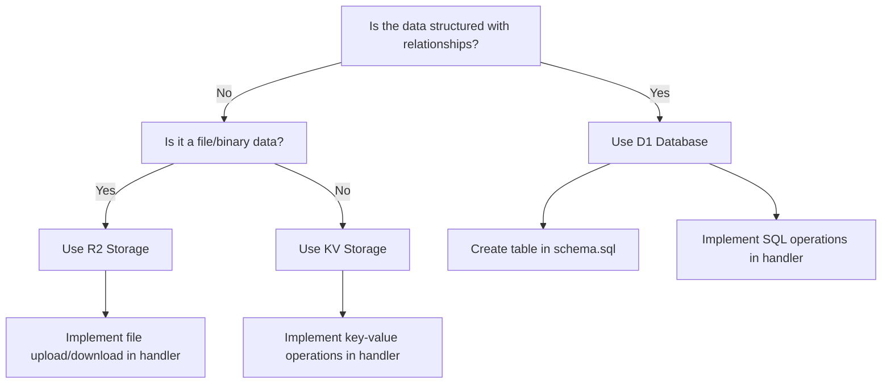

# API Development Workflow Documentation

## Overview

This document outlines the standard workflow for creating or modifying API endpoints in the Farewell/Howdy unified platform. The platform uses a consistent pattern for implementing CRUD (Create, Read, Update, Delete) operations across different content types including events, blog posts, menus, business hours, and featured content.

## Architecture Overview

The application follows a structured API architecture:

1. **Backend Storage**:
   - **D1 Database**: SQL database for structured data (events, menus, blog posts, business hours)
   - **KV Storage**: Key-value storage for simpler data structures (featured content, settings)
   - **R2 Storage**: Object storage for media files (images, flyers)

2. **API Handler Structure**:
   - Each content type has a dedicated handler file in `src/handlers/`
   - All handlers follow a similar pattern with action-based dispatching
   - Common response format for consistency

3. **API Endpoints**:
   - Public API endpoints (accessible without authentication)
   - Admin API endpoints (requires authentication)
   - Protected admin endpoints (using middleware for auth verification)

4. **Client-side Integration**:
   - Standardized API utility in admin panel for API calls
   - Consistent error handling and response processing

## Standard Handler Structure

Each API handler follows this structure:

```typescript
// src/handlers/example.ts
import { Context } from 'hono';
import { Env } from '../types/env';

// Define action types for this handler
type ExampleAction = 'list' | 'create' | 'update' | 'delete';

// Main handler function - dispatches to specific action handlers
export async function handleExample(c: Context<{ Bindings: Env }>, action: ExampleAction) {
  switch (action) {
    case 'list':
      return listExamples(c);
    case 'create':
      return createExample(c);
    case 'update':
      return updateExample(c);
    case 'delete':
      return deleteExample(c);
    default:
      return c.json({ success: false, error: "Invalid action" }, 400);
  }
}

// Action-specific handler functions
async function listExamples(c: Context<{ Bindings: Env }>) {
  // Implementation for listing items
}

async function createExample(c: Context<{ Bindings: Env }>) {
  // Implementation for creating an item
}

async function updateExample(c: Context<{ Bindings: Env }>) {
  // Implementation for updating an item
}

async function deleteExample(c: Context<{ Bindings: Env }>) {
  // Implementation for deleting an item
}
```

## API Response Format

All API responses follow this standard format:

```typescript
// Success response
return c.json({ 
  success: true, 
  data: resultData 
});

// Error response
return c.json({ 
  success: false, 
  error: "Error message" 
}, statusCode);
```

## Storage Selection Guidelines

| Storage Type | Use Case | Examples |
|--------------|----------|----------|
| D1 Database | Structured data with relationships | Events, Menus, Blog posts |
| KV Storage | Simple configuration, key-value data | Featured content, Site settings |
| R2 Storage | Media files, large binary data | Images, Flyers, Videos |

## Standard Workflow for Creating a New API Endpoint

### 1. Define Data Requirements

- Determine what data needs to be stored and how it should be structured
- Choose the appropriate storage backend (D1, KV, R2)
- For D1 storage, update `database/schema.sql` with table definitions

### 2. Create or Update Handler File

- Create a new file in `src/handlers/` or update an existing one
- Follow the standard handler structure with action dispatching
- Implement all required CRUD operations
- Include proper error handling and validation

**Example handler structure for D1-based content:**

```typescript
// src/handlers/example.ts
import { Context } from 'hono';
import { Env } from '../types/env';

type ExampleAction = 'list' | 'create' | 'update' | 'delete';

export async function handleExample(c: Context<{ Bindings: Env }>, action: ExampleAction) {
  const { FWHY_D1 } = c.env;
  
  switch (action) {
    case 'list':
      return listExamples(c);
    case 'create':
      return createExample(c);
    case 'update':
      return updateExample(c);
    case 'delete':
      return deleteExample(c);
    default:
      return c.json({ success: false, error: "Invalid action" }, 400);
  }
}

async function listExamples(c: Context<{ Bindings: Env }>) {
  const { FWHY_D1 } = c.env;
  
  // Handle filtering parameters if needed
  const someFilter = c.req.query('filter');
  
  let query = "SELECT * FROM examples ORDER BY created_at DESC";
  let params: any[] = [];
  
  if (someFilter) {
    query = "SELECT * FROM examples WHERE some_field = ? ORDER BY created_at DESC";
    params = [someFilter];
  }
  
  try {
    const { results } = await FWHY_D1.prepare(query).bind(...params).all();
    return c.json({ success: true, data: results || [] });
  } catch (error) {
    console.error('Error listing examples:', error);
    return c.json({ success: false, error: "Failed to list examples" }, 500);
  }
}

async function createExample(c: Context<{ Bindings: Env }>) {
  const { FWHY_D1 } = c.env;
  const data = await c.req.json();
  
  // Validate required fields
  if (!data.name) {
    return c.json({ success: false, error: "Name is required" }, 400);
  }
  
  try {
    const result = await FWHY_D1.prepare(`
      INSERT INTO examples (name, description, created_at, updated_at)
      VALUES (?, ?, datetime('now'), datetime('now'))
    `).bind(data.name, data.description || '').run();
    
    return c.json({ success: true, data: { id: result.lastInsertRowId } });
  } catch (error) {
    console.error('Error creating example:', error);
    return c.json({ success: false, error: "Failed to create example" }, 500);
  }
}

// Implement update and delete similarly
```

**Example handler structure for KV-based content:**

```typescript
// src/handlers/settings.ts
import { Context } from 'hono';
import { Env } from '../types/env';

type SettingsAction = 'get' | 'update';

export async function handleSettings(c: Context<{ Bindings: Env }>, action: SettingsAction) {
  const { FWHY_KV } = c.env;
  
  switch (action) {
    case 'get':
      return getSettings(c);
    case 'update':
      return updateSettings(c);
    default:
      return c.json({ success: false, error: "Invalid action" }, 400);
  }
}

async function getSettings(c: Context<{ Bindings: Env }>) {
  const { FWHY_KV } = c.env;
  const key = c.req.query('key') || 'general';
  
  try {
    const settingsData = await FWHY_KV.get(key);
    const settings = settingsData ? JSON.parse(settingsData) : {};
    
    return c.json({ success: true, data: settings });
  } catch (error) {
    console.error('Error getting settings:', error);
    return c.json({ success: false, error: "Failed to retrieve settings" }, 500);
  }
}

async function updateSettings(c: Context<{ Bindings: Env }>) {
  const { FWHY_KV } = c.env;
  const key = c.req.query('key') || 'general';
  const data = await c.req.json();
  
  try {
    // Get current settings
    const settingsData = await FWHY_KV.get(key);
    const currentSettings = settingsData ? JSON.parse(settingsData) : {};
    
    // Update with new data
    const updatedSettings = {
      ...currentSettings,
      ...data,
      updated_at: new Date().toISOString()
    };
    
    // Save to KV store
    await FWHY_KV.put(key, JSON.stringify(updatedSettings));
    
    return c.json({ success: true, data: updatedSettings });
  } catch (error) {
    console.error('Error updating settings:', error);
    return c.json({ success: false, error: "Failed to update settings" }, 500);
  }
}
```

**Example handler structure for R2-based content:**

```typescript
// For file uploads like blog images or event flyers
async function uploadFile(c: Context<{ Bindings: Env }>) {
  const { FWHY_IMAGES } = c.env;
  
  try {
    const formData = await c.req.formData();
    const file = formData.get('file') as File;
    
    if (!file) {
      return c.json({ success: false, error: "No file provided" }, 400);
    }
    
    // Generate a unique filename
    const fileExtension = file.name.split('.').pop();
    const fileName = `${Date.now()}-${Math.random().toString(36).substring(2, 15)}.${fileExtension}`;
    const folderPath = formData.get('folder') as string || 'uploads';
    const filePath = `${folderPath}/${fileName}`;
    
    // Upload to R2
    await FWHY_IMAGES.put(filePath, await file.arrayBuffer(), {
      httpMetadata: {
        contentType: file.type,
      }
    });
    
    // Return the URL for the uploaded file
    return c.json({ 
      success: true, 
      data: { 
        url: `/images/${filePath}`,
        fileName: fileName,
        path: filePath
      } 
    });
  } catch (error) {
    console.error('Error uploading file:', error);
    return c.json({ success: false, error: "Failed to upload file" }, 500);
  }
}
```

### 3. Update Routes in index.ts

Add the necessary routes in `src/index.ts`:

```typescript
// Import the handler
import { handleExample } from './handlers/example';

// For public API (no authentication required)
publicApi.get('/examples', (c) => handleExample(c, 'list'));

// For admin API (authentication required)
protectedAdminApi.get('/examples', (c) => handleExample(c, 'list'));
protectedAdminApi.post('/examples', (c) => handleExample(c, 'create'));
protectedAdminApi.put('/examples/:id', (c) => handleExample(c, 'update'));
protectedAdminApi.delete('/examples/:id', (c) => handleExample(c, 'delete'));
```

### 4. Implement Client-Side Admin Interface

Create the necessary client-side code in the admin panel:

```javascript
// In public/jss/admin-unified.js or a dedicated module

// Function to load examples from API
async function loadExamples() {
  try {
    const response = await api.get('/api/admin/examples');
    if (response && response.success) {
      renderExamplesList(response.data);
    } else {
      showToast('Failed to load examples', 'error');
    }
  } catch (error) {
    console.error('Error loading examples:', error);
    showToast('Error loading examples', 'error');
  }
}

// Function to save an example
async function saveExample(data) {
  try {
    let response;
    
    if (data.id) {
      // Update existing example
      response = await api.put(`/api/admin/examples/${data.id}`, data);
    } else {
      // Create new example
      response = await api.post('/api/admin/examples', data);
    }
    
    if (response && response.success) {
      showToast('Example saved successfully', 'success');
      loadExamples(); // Refresh the list
    } else {
      showToast('Failed to save example', 'error');
    }
  } catch (error) {
    console.error('Error saving example:', error);
    showToast('Error saving example', 'error');
  }
}

// Function to delete an example
async function deleteExample(id) {
  if (!confirm('Are you sure you want to delete this example?')) return;
  
  try {
    const response = await api.delete(`/api/admin/examples/${id}`);
    
    if (response) {
      showToast('Example deleted successfully', 'success');
      loadExamples(); // Refresh the list
    } else {
      showToast('Failed to delete example', 'error');
    }
  } catch (error) {
    console.error('Error deleting example:', error);
    showToast('Error deleting example', 'error');
  }
}
```

### 5. Implement Public Display (if needed)

Create the necessary client-side code for the public site:

```javascript
// In public/jss/script.js or a dedicated module

// Function to load examples from API
async function loadPublicExamples() {
  try {
    const response = await fetch('/api/examples');
    const data = await response.json();
    
    if (data && data.success) {
      renderPublicExamples(data.data);
    } else {
      console.error('Failed to load examples');
    }
  } catch (error) {
    console.error('Error loading examples:', error);
  }
}

// Function to render examples on the page
function renderPublicExamples(examples) {
  const container = document.getElementById('examples-container');
  if (!container) return;
  
  if (!examples || examples.length === 0) {
    container.innerHTML = '<p>No examples available</p>';
    return;
  }
  
  container.innerHTML = examples.map(example => `
    <div class="example-item">
      <h3>${example.name}</h3>
      <p>${example.description || ''}</p>
    </div>
  `).join('');
}

// Load examples when the page loads
document.addEventListener('DOMContentLoaded', loadPublicExamples);
```

### 6. Testing and Validation

1. Test the API endpoints using browser devtools or a tool like Postman
2. Verify both success and error cases
3. Test data validation and security constraints
4. Ensure proper authorization checks are in place for admin endpoints

## Error Handling Best Practices

1. **Client-side Errors**:
   - Always catch API call errors and display user-friendly messages
   - Include helpful context in error messages
   - Log detailed errors to console for debugging

2. **Server-side Errors**:
   - Always return a standard error response format
   - Include appropriate HTTP status codes
   - Log detailed error information on the server
   - Avoid exposing sensitive information in error responses

```typescript
// Server-side error handling example
try {
  // Database operation
} catch (error) {
  console.error('Detailed error:', error);
  return c.json({ 
    success: false, 
    error: "User-friendly error message" 
  }, 500);
}
```

## Security Considerations

1. **Input Validation**:
   - Always validate and sanitize input data
   - Use parameterized queries for database operations
   - Reject unexpected or malformed input

2. **Authentication & Authorization**:
   - Use the authMiddleware for all admin routes
   - Verify permissions for sensitive operations
   - Implement proper token validation and expiration

3. **CORS and Headers**:
   - Use appropriate CORS settings
   - Set security headers for API responses

## Storage Backend Selection Flowchart



## Common D1 Database Patterns

### List with Pagination

```typescript
async function listWithPagination(c: Context<{ Bindings: Env }>) {
  const { FWHY_D1 } = c.env;
  const page = parseInt(c.req.query('page') || '1');
  const limit = parseInt(c.req.query('limit') || '20');
  const offset = (page - 1) * limit;
  
  try {
    // Get total count
    const countResult = await FWHY_D1.prepare("SELECT COUNT(*) as total FROM examples").all();
    const total = countResult.results[0].total;
    
    // Get paginated data
    const { results } = await FWHY_D1.prepare(
      "SELECT * FROM examples ORDER BY created_at DESC LIMIT ? OFFSET ?"
    ).bind(limit, offset).all();
    
    return c.json({ 
      success: true, 
      data: results || [],
      pagination: {
        page,
        limit,
        total,
        totalPages: Math.ceil(total / limit)
      }
    });
  } catch (error) {
    console.error('Error listing examples:', error);
    return c.json({ success: false, error: "Failed to list examples" }, 500);
  }
}
```

### Search and Filter

```typescript
async function searchAndFilter(c: Context<{ Bindings: Env }>) {
  const { FWHY_D1 } = c.env;
  const search = c.req.query('q');
  const category = c.req.query('category');
  
  let query = "SELECT * FROM examples WHERE 1=1";
  let params: any[] = [];
  
  if (search) {
    query += " AND (name LIKE ? OR description LIKE ?)";
    params.push(`%${search}%`, `%${search}%`);
  }
  
  if (category) {
    query += " AND category = ?";
    params.push(category);
  }
  
  query += " ORDER BY created_at DESC";
  
  try {
    const { results } = await FWHY_D1.prepare(query).bind(...params).all();
    return c.json({ success: true, data: results || [] });
  } catch (error) {
    console.error('Error searching examples:', error);
    return c.json({ success: false, error: "Failed to search examples" }, 500);
  }
}
```

## Common KV Storage Patterns

### Versioned Settings

```typescript
async function updateVersionedSettings(c: Context<{ Bindings: Env }>) {
  const { FWHY_KV } = c.env;
  const key = c.req.query('key') || 'settings';
  const data = await c.req.json();
  
  try {
    // Get current settings
    const currentData = await FWHY_KV.get(key);
    const current = currentData ? JSON.parse(currentData) : {};
    
    // Update with new version
    const version = (current.version || 0) + 1;
    const updated = {
      ...current,
      ...data,
      version,
      updated_at: new Date().toISOString()
    };
    
    // Save current version
    await FWHY_KV.put(key, JSON.stringify(updated));
    
    // Also save historical version
    await FWHY_KV.put(`${key}_v${version}`, JSON.stringify(updated));
    
    return c.json({ success: true, data: updated });
  } catch (error) {
    console.error('Error updating settings:', error);
    return c.json({ success: false, error: "Failed to update settings" }, 500);
  }
}
```

## Common R2 Storage Patterns

### Secure File Uploads with Content Type Validation

```typescript
async function secureFileUpload(c: Context<{ Bindings: Env }>) {
  const { FWHY_IMAGES } = c.env;
  
  try {
    const formData = await c.req.formData();
    const file = formData.get('file') as File;
    
    if (!file) {
      return c.json({ success: false, error: "No file provided" }, 400);
    }
    
    // Validate file type
    const allowedTypes = ['image/jpeg', 'image/png', 'image/gif', 'image/webp'];
    if (!allowedTypes.includes(file.type)) {
      return c.json({ success: false, error: "Invalid file type" }, 400);
    }
    
    // Validate file size (5MB max)
    const maxSize = 5 * 1024 * 1024; // 5MB
    if (file.size > maxSize) {
      return c.json({ success: false, error: "File too large (max 5MB)" }, 400);
    }
    
    // Generate a unique filename with original extension
    const fileExtension = file.name.split('.').pop();
    const fileName = `${Date.now()}-${Math.random().toString(36).substring(2, 15)}.${fileExtension}`;
    const folderPath = formData.get('folder') as string || 'uploads';
    const filePath = `${folderPath}/${fileName}`;
    
    // Upload to R2 with appropriate metadata
    await FWHY_IMAGES.put(filePath, await file.arrayBuffer(), {
      httpMetadata: {
        contentType: file.type,
        cacheControl: 'public, max-age=31536000', // 1 year cache
      }
    });
    
    // Return the URL for the uploaded file
    return c.json({ 
      success: true, 
      data: { 
        url: `/images/${filePath}`,
        fileName: fileName,
        path: filePath,
        type: file.type,
        size: file.size
      } 
    });
  } catch (error) {
    console.error('Error uploading file:', error);
    return c.json({ success: false, error: "Failed to upload file" }, 500);
  }
}
```

## Conclusion

Following this standardized workflow ensures consistency across all API endpoints in the Farewell/Howdy unified platform. This approach makes the code more maintainable, reduces bugs, and provides a better developer experience.

When adding new features or content types, always start by determining the data structure and storage requirements, then follow these patterns to implement the necessary handlers, routes, and client-side code.
